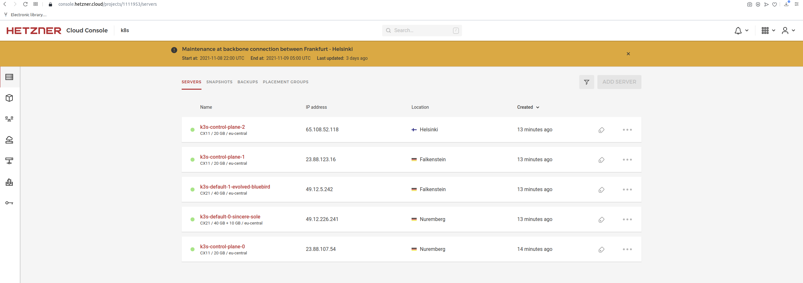
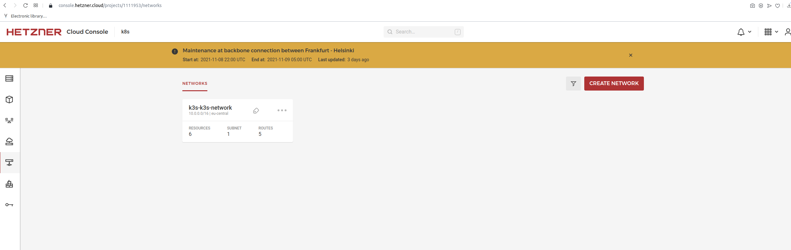
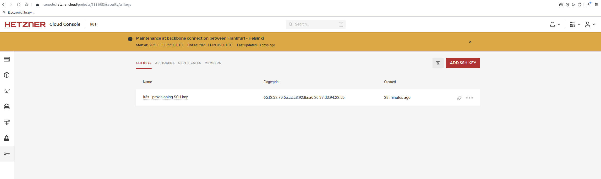
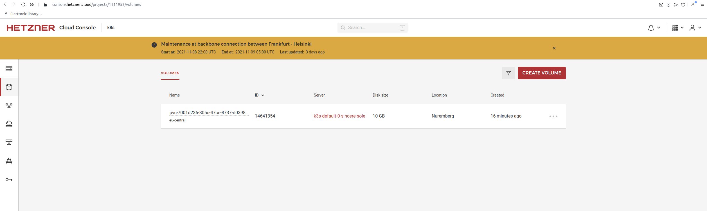
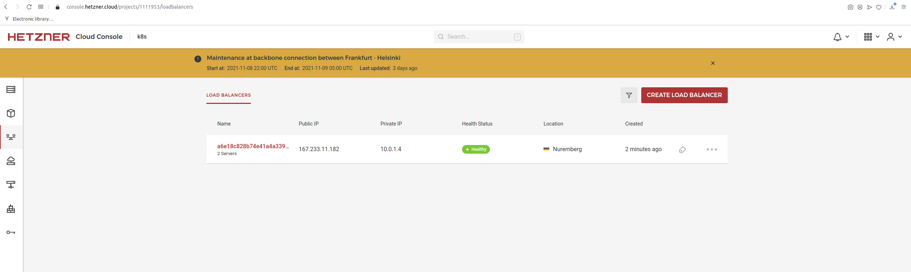

# k3s-hcloud


### Zero friction Kubernetes stack on Hetzner Cloud

This [terraform](https://www.terraform.io/) module will install a High Availability [K3s](https://k3s.io/) Cluster with Embedded DB in a private network on [Hetzner Cloud](https://www.hetzner.com/de/cloud). The following resources are provisionised by default (**20€/mo**):

- 3x Control-plane: _CX11_, 2GB RAM, 1VCPU, 20GB NVMe, 20TB Traffic.
- 2x Worker: _CX21_, 4GB RAM, 2VCPU, 40GB NVMe, 20TB Traffic.
- Network: Private network with one subnet.
- Server and agent nodes are distributed across 3 Datacenters (nbg1, fsn1, hel1) for high availability.

</br>
</br>

**Hetzner Cloud integration**:

- Preinstalled [CSI-driver](https://github.com/hetznercloud/csi-driver) for volume support.
- Preinstalled [Cloud Controller Manager for Hetzner Cloud](https://github.com/hetznercloud/hcloud-cloud-controller-manager) for Load Balancer support.

**Auto-K3s-Upgrades**

We provide an example how to upgrade your K3s node and agents with the [system-upgrade-controller](https://github.com/rancher/system-upgrade-controller). Check out [/upgrade](./upgrade)

**What is K3s?**

K3s is a lightweight certified kubernetes distribution. It's packaged as single binary and comes with solid defaults for storage and networking but we replaced [local-path-provisioner](https://github.com/rancher/local-path-provisioner) with hetzner [CSI-driver](https://github.com/hetznercloud/csi-driver) and [klipper load-balancer](https://github.com/k3s-io/klipper-lb) with hetzner [Cloud Controller Manager](https://github.com/hetznercloud/hcloud-cloud-controller-manager). The default ingress controller (traefik) has been disabled.

## Usage

See a more detailed example with walk-through in the [example folder](./example).

<!-- BEGINNING OF PRE-COMMIT-TERRAFORM DOCS HOOK -->
### Inputs

| Name | Description | Type | Default | Required |
|------|-------------|------|---------|:--------:|
| <a name="input_agent_groups"></a> [agent\_groups](#input\_agent\_groups) | Configuration of agent groups | <pre>map(object({<br>    type      = string<br>    count     = number<br>    ip_offset = number<br>  }))</pre> | <pre>{<br>  "default": {<br>    "count": 2,<br>    "ip_offset": 33,<br>    "type": "cx21"<br>  }<br>}</pre> | no |
| <a name="input_control_plane_server_count"></a> [control\_plane\_server\_count](#input\_control\_plane\_server\_count) | Number of control plane nodes | `number` | `3` | no |
| <a name="input_control_plane_server_type"></a> [control\_plane\_server\_type](#input\_control\_plane\_server\_type) | Server type of control plane servers | `string` | `"cx11"` | no |
| <a name="input_create_kubeconfig"></a> [create\_kubeconfig](#input\_create\_kubeconfig) | Create a local kubeconfig file to connect to the cluster | `bool` | `true` | no |
| <a name="input_hcloud_csi_driver_version"></a> [hcloud\_csi\_driver\_version](#input\_hcloud\_csi\_driver\_version) | n/a | `string` | `"v1.5.3"` | no |
| <a name="input_hcloud_token"></a> [hcloud\_token](#input\_hcloud\_token) | Token to authenticate against Hetzner Cloud | `any` | n/a | yes |
| <a name="input_k3s_version"></a> [k3s\_version](#input\_k3s\_version) | K3s version | `string` | `"v1.21.3+k3s1"` | no |
| <a name="input_kubeconfig_filename"></a> [kubeconfig\_filename](#input\_kubeconfig\_filename) | Specify the filename of the created kubeconfig file (defaults to kubeconfig-${var.name}.yaml | `any` | `null` | no |
| <a name="input_name"></a> [name](#input\_name) | Cluster name (used in various places, don't use special chars) | `any` | n/a | yes |
| <a name="input_network_cidr"></a> [network\_cidr](#input\_network\_cidr) | Network in which the cluster will be placed | `string` | `"10.0.0.0/16"` | no |
| <a name="input_server_additional_packages"></a> [server\_additional\_packages](#input\_server\_additional\_packages) | Additional packages which will be installed on node creation | `list(string)` | `[]` | no |
| <a name="input_server_locations"></a> [server\_locations](#input\_server\_locations) | Server locations in which servers will be distributed | `list(string)` | <pre>[<br>  "nbg1",<br>  "fsn1",<br>  "hel1"<br>]</pre> | no |
| <a name="input_ssh_private_key_location"></a> [ssh\_private\_key\_location](#input\_ssh\_private\_key\_location) | Use this private SSH key instead of generating a new one (Attention: Encrypted keys are not supported) | `string` | `null` | no |
| <a name="input_subnet_cidr"></a> [subnet\_cidr](#input\_subnet\_cidr) | Subnet in which all nodes are placed | `string` | `"10.0.1.0/24"` | no |

### Outputs

| Name | Description |
|------|-------------|
| <a name="output_agents_public_ips"></a> [agents\_public\_ips](#output\_agents\_public\_ips) | The public IP addresses of the agent servers |
| <a name="output_control_planes_public_ips"></a> [control\_planes\_public\_ips](#output\_control\_planes\_public\_ips) | The public IP addresses of the control plane servers |
| <a name="output_k3s_token"></a> [k3s\_token](#output\_k3s\_token) | Secret k3s authentication token |
| <a name="output_kubeconfig"></a> [kubeconfig](#output\_kubeconfig) | Structured kubeconfig data to supply to other providers |
| <a name="output_kubeconfig_file"></a> [kubeconfig\_file](#output\_kubeconfig\_file) | Kubeconfig file content with external IP address |
| <a name="output_network_id"></a> [network\_id](#output\_network\_id) | n/a |
| <a name="output_ssh_private_key"></a> [ssh\_private\_key](#output\_ssh\_private\_key) | Key to SSH into nodes |
<!-- END OF PRE-COMMIT-TERRAFORM DOCS HOOK -->

## Common Operations

### Agent server replacement

If you need to cycle an agent, you can do that with a single node following this procedure.
Replace the group name and number with the server you want to recreate!

Make sure you drain the nodes first. 

```shell
terraform taint 'module.my_cluster.module.agent_group["GROUP_NAME"].random_pet.agent_suffix[1]'
terraform apply
```

This will recreate the agent in that group on next apply.

### Control Plane server replacement

Currently you should only replace the servers which didn't initialize the cluster.

```shell
terraform taint 'module.my_cluster.hcloud_server.control_plane["#1"]'
terraform apply
```

## Auto-Upgrade

### Prerequisite

Install the system-upgrade-controller in your cluster.

```
KUBECONFIG=kubeconfig.yaml kubectl apply -f ./upgrade/controller.yaml
```

## Upgrade procedure

1. Mark the nodes you want to upgrade (The script will mark all nodes).

```
KUBECONFIG=kubeconfig.yaml kubectl label --all node k3s-upgrade=true
```

2. Run the plan for the **servers**.

```
KUBECONFIG=kubeconfig.yaml kubectl apply -f ./upgrade/server-plan.yaml
```

**Warning:** Wait for completion [before you start upgrading your agents](https://github.com/k3s-io/k3s/issues/2996#issuecomment-788352375).

3. Run the plan for the **agents**.

```
KUBECONFIG=kubeconfig.yaml kubectl apply -f ./upgrade/agent-plan.yaml
```

## Backups

K3s will automatically backup your embedded etcd datastore every 12 hours to `/var/lib/rancher/k3s/server/db/snapshots/`.
You can reset the cluster by pointing to a specific snapshot.

1. Stop the master server.

```sh
sudo systemctl stop k3s
```

2. Restore the master server with a snapshot

```sh
./k3s server \
  --cluster-reset \
  --cluster-reset-restore-path=<PATH-TO-SNAPSHOT>
```

**Warning:** This forget all peers and the server becomes the sole member of a new cluster. You have to manually rejoin all servers.

3. Connect you with the different servers backup and delete `/var/lib/rancher/k3s/server/db` on each peer etcd server and rejoin the nodes.

```sh
sudo systemctl stop k3s
rm -rf /var/lib/rancher/k3s/server/db
sudo systemctl start k3s
```

This will rejoin the server with the master server and seed the etcd store.

**Info:** It exists no official tool to automate the procedure. In future, rancher might provide an operator to handle this ([issue](https://github.com/k3s-io/k3s/issues/3174)).

## Debugging

Cloud init logs can be found on the remote machines in:

- `/var/log/cloud-init-output.log`
- `/var/log/cloud-init.log`
- `journalctl -u k3s.service -e` last logs of the server
- `journalctl -u k3s-agent.service -e` last logs of the agent

## Known issues

- Sometimes at cluster bootstrapping the Cloud-Controllers reports that some routes couldn't be created. This issue was fixed in master but wasn't released yet. Restart the cloud-controller pod and it will recreate them.

## Credits

- [terraform-hcloud-k3s](https://github.com/cicdteam/terraform-hcloud-k3s) Terraform module which creates a single node cluster.
- [terraform-module-k3](https://github.com/xunleii/terraform-module-k3s) Terraform module which creates a k3s cluster, with multi-server and management features.
- Icon created by [Freepik](https://www.freepik.com) from [www.flaticon.com](https://www.flaticon.com/de/)

## Example:

```
terraform apply

var.hcloud_token
  Token to authenticate against Hetzner Cloud

  Enter a value: XXXXXXXXXXXXXXXXXXXXXXXXXXXXXXXXXXXXXXXXXXXXXXXXXXXXXXXXXXX

var.name
  Cluster name (used in various places, don't use special chars)

  Enter a value: k3s
  
  ...
  
  
  Enter a value: yes

random_password.k3s_cluster_secret: Creating...
random_password.k3s_cluster_secret: Creation complete after 0s [id=none]
hcloud_network.k3s: Creating...
hcloud_ssh_key.provision_public: Creating...
hcloud_network.k3s: Creation complete after 3s [id=1260682]
hcloud_network_subnet.k3s_nodes: Creating...
hcloud_ssh_key.provision_public: Creation complete after 4s [id=4777097]
hcloud_server.first_control_plane: Creating...
hcloud_network_subnet.k3s_nodes: Creation complete after 3s [id=1260682-10.0.1.0/24]
hcloud_server.first_control_plane: Still creating... [10s elapsed]
hcloud_server.first_control_plane: Provisioning with 'remote-exec'...
hcloud_server.first_control_plane (remote-exec): Connecting to remote host via SSH...
hcloud_server.first_control_plane (remote-exec):   Host: 23.88.107.54
hcloud_server.first_control_plane (remote-exec):   User: root
hcloud_server.first_control_plane (remote-exec):   Password: false
hcloud_server.first_control_plane (remote-exec):   Private key: true
hcloud_server.first_control_plane (remote-exec):   Certificate: false
hcloud_server.first_control_plane (remote-exec):   SSH Agent: true
hcloud_server.first_control_plane (remote-exec):   Checking Host Key: false
hcloud_server.first_control_plane (remote-exec):   Target Platform: unix
hcloud_server.first_control_plane (remote-exec): Connecting to remote host via SSH...
hcloud_server.first_control_plane (remote-exec):   Host: 23.88.107.54
hcloud_server.first_control_plane (remote-exec):   User: root
hcloud_server.first_control_plane (remote-exec):   Password: false
hcloud_server.first_control_plane (remote-exec):   Private key: true
hcloud_server.first_control_plane (remote-exec):   Certificate: false
hcloud_server.first_control_plane (remote-exec):   SSH Agent: true
hcloud_server.first_control_plane (remote-exec):   Checking Host Key: false
hcloud_server.first_control_plane (remote-exec):   Target Platform: unix
hcloud_server.first_control_plane: Still creating... [20s elapsed]
hcloud_server.first_control_plane (remote-exec): Connecting to remote host via SSH...
hcloud_server.first_control_plane (remote-exec):   Host: 23.88.107.54
hcloud_server.first_control_plane (remote-exec):   User: root
hcloud_server.first_control_plane (remote-exec):   Password: false
hcloud_server.first_control_plane (remote-exec):   Private key: true
hcloud_server.first_control_plane (remote-exec):   Certificate: false
hcloud_server.first_control_plane (remote-exec):   SSH Agent: true
hcloud_server.first_control_plane (remote-exec):   Checking Host Key: false
hcloud_server.first_control_plane (remote-exec):   Target Platform: unix
hcloud_server.first_control_plane (remote-exec): Connecting to remote host via SSH...
hcloud_server.first_control_plane (remote-exec):   Host: 23.88.107.54
hcloud_server.first_control_plane (remote-exec):   User: root
hcloud_server.first_control_plane (remote-exec):   Password: false
hcloud_server.first_control_plane (remote-exec):   Private key: true
hcloud_server.first_control_plane (remote-exec):   Certificate: false
hcloud_server.first_control_plane (remote-exec):   SSH Agent: true
hcloud_server.first_control_plane (remote-exec):   Checking Host Key: false
hcloud_server.first_control_plane (remote-exec):   Target Platform: unix
hcloud_server.first_control_plane (remote-exec): Connected!
hcloud_server.first_control_plane: Still creating... [30s elapsed]
hcloud_server.first_control_plane: Still creating... [40s elapsed]
hcloud_server.first_control_plane: Still creating... [50s elapsed]
hcloud_server.first_control_plane: Still creating... [1m0s elapsed]
hcloud_server.first_control_plane: Still creating... [1m10s elapsed]
hcloud_server.first_control_plane (remote-exec): NAME                  STATUS   ROLES                       AGE   VERSION
hcloud_server.first_control_plane (remote-exec): k3s-control-plane-0   Ready    control-plane,etcd,master   27s   v1.21.3+k3s1
hcloud_server.first_control_plane (remote-exec): node/k3s-control-plane-0 tainted
hcloud_server.first_control_plane (remote-exec): node/k3s-control-plane-0 tainted
hcloud_server.first_control_plane (remote-exec): secret/hcloud created
hcloud_server.first_control_plane (remote-exec): /tmp/terraform_1794469539.sh: 1: --cloud-provider=external: not found
hcloud_server.first_control_plane (remote-exec): serviceaccount/cloud-controller-manager created
hcloud_server.first_control_plane (remote-exec): clusterrolebinding.rbac.authorization.k8s.io/system:cloud-controller-manager created
hcloud_server.first_control_plane (remote-exec): deployment.apps/hcloud-cloud-controller-manager created
hcloud_server.first_control_plane (remote-exec): secret/hcloud-csi created
hcloud_server.first_control_plane (remote-exec): csidriver.storage.k8s.io/csi.hetzner.cloud created
hcloud_server.first_control_plane (remote-exec): storageclass.storage.k8s.io/hcloud-volumes created
hcloud_server.first_control_plane (remote-exec): serviceaccount/hcloud-csi created
hcloud_server.first_control_plane (remote-exec): clusterrole.rbac.authorization.k8s.io/hcloud-csi created
hcloud_server.first_control_plane (remote-exec): clusterrolebinding.rbac.authorization.k8s.io/hcloud-csi created
hcloud_server.first_control_plane (remote-exec): statefulset.apps/hcloud-csi-controller created
hcloud_server.first_control_plane (remote-exec): daemonset.apps/hcloud-csi-node created
hcloud_server.first_control_plane (remote-exec): service/hcloud-csi-controller-metrics created
hcloud_server.first_control_plane (remote-exec): service/hcloud-csi-node-metrics created
hcloud_server.first_control_plane: Creation complete after 1m20s [id=15796848]
module.agent_group["default"].data.hcloud_image.ubuntu: Reading...
data.remotefile.kubeconfig: Reading...
hcloud_server_network.first_control_plane: Creating...
hcloud_server.control_plane["#1"]: Creating...
module.agent_group["default"].random_pet.agent_suffix[0]: Creating...
module.agent_group["default"].random_pet.agent_suffix[0]: Creation complete after 0s [id=sincere-sole]
hcloud_server.control_plane["#2"]: Creating...
module.agent_group["default"].random_pet.agent_suffix[1]: Creating...
module.agent_group["default"].random_pet.agent_suffix[1]: Creation complete after 0s [id=evolved-bluebird]
module.agent_group["default"].data.hcloud_image.ubuntu: Read complete after 0s [name=ubuntu-20.04]
module.agent_group["default"].hcloud_server.agent["#1"]: Creating...
module.agent_group["default"].hcloud_server.agent["#0"]: Creating...
data.remotefile.kubeconfig: Read complete after 1s [id=23.88.107.54:/etc/rancher/k3s/k3s.yaml]
local_file.kubeconfig[0]: Creating...
local_file.kubeconfig[0]: Creation complete after 0s [id=8d367f8fd330c657a0d5c1aff9308b677a122a4c]
hcloud_server_network.first_control_plane: Creation complete after 2s [id=15796848-1260682]
hcloud_server.control_plane["#1"]: Still creating... [10s elapsed]
hcloud_server.control_plane["#2"]: Still creating... [10s elapsed]
module.agent_group["default"].hcloud_server.agent["#1"]: Still creating... [10s elapsed]
module.agent_group["default"].hcloud_server.agent["#0"]: Still creating... [10s elapsed]
hcloud_server.control_plane["#2"]: Provisioning with 'remote-exec'...
hcloud_server.control_plane["#2"] (remote-exec): Connecting to remote host via SSH...
hcloud_server.control_plane["#2"] (remote-exec):   Host: 65.108.52.118
hcloud_server.control_plane["#2"] (remote-exec):   User: root
hcloud_server.control_plane["#2"] (remote-exec):   Password: false
hcloud_server.control_plane["#2"] (remote-exec):   Private key: true
hcloud_server.control_plane["#2"] (remote-exec):   Certificate: false
hcloud_server.control_plane["#2"] (remote-exec):   SSH Agent: true
hcloud_server.control_plane["#2"] (remote-exec):   Checking Host Key: false
hcloud_server.control_plane["#2"] (remote-exec):   Target Platform: unix
module.agent_group["default"].hcloud_server.agent["#1"]: Provisioning with 'remote-exec'...
module.agent_group["default"].hcloud_server.agent["#1"] (remote-exec): Connecting to remote host via SSH...
module.agent_group["default"].hcloud_server.agent["#1"] (remote-exec):   Host: 49.12.5.242
module.agent_group["default"].hcloud_server.agent["#1"] (remote-exec):   User: root
module.agent_group["default"].hcloud_server.agent["#1"] (remote-exec):   Password: false
module.agent_group["default"].hcloud_server.agent["#1"] (remote-exec):   Private key: true
module.agent_group["default"].hcloud_server.agent["#1"] (remote-exec):   Certificate: false
module.agent_group["default"].hcloud_server.agent["#1"] (remote-exec):   SSH Agent: true
module.agent_group["default"].hcloud_server.agent["#1"] (remote-exec):   Checking Host Key: false
module.agent_group["default"].hcloud_server.agent["#1"] (remote-exec):   Target Platform: unix
module.agent_group["default"].hcloud_server.agent["#0"]: Provisioning with 'remote-exec'...
module.agent_group["default"].hcloud_server.agent["#0"] (remote-exec): Connecting to remote host via SSH...
module.agent_group["default"].hcloud_server.agent["#0"] (remote-exec):   Host: 49.12.226.241
module.agent_group["default"].hcloud_server.agent["#0"] (remote-exec):   User: root
module.agent_group["default"].hcloud_server.agent["#0"] (remote-exec):   Password: false
module.agent_group["default"].hcloud_server.agent["#0"] (remote-exec):   Private key: true
module.agent_group["default"].hcloud_server.agent["#0"] (remote-exec):   Certificate: false
module.agent_group["default"].hcloud_server.agent["#0"] (remote-exec):   SSH Agent: true
module.agent_group["default"].hcloud_server.agent["#0"] (remote-exec):   Checking Host Key: false
module.agent_group["default"].hcloud_server.agent["#0"] (remote-exec):   Target Platform: unix
hcloud_server.control_plane["#2"] (remote-exec): Connecting to remote host via SSH...
hcloud_server.control_plane["#2"] (remote-exec):   Host: 65.108.52.118
hcloud_server.control_plane["#2"] (remote-exec):   User: root
hcloud_server.control_plane["#2"] (remote-exec):   Password: false
hcloud_server.control_plane["#2"] (remote-exec):   Private key: true
hcloud_server.control_plane["#2"] (remote-exec):   Certificate: false
hcloud_server.control_plane["#2"] (remote-exec):   SSH Agent: true
hcloud_server.control_plane["#2"] (remote-exec):   Checking Host Key: false
hcloud_server.control_plane["#2"] (remote-exec):   Target Platform: unix
hcloud_server.control_plane["#1"]: Provisioning with 'remote-exec'...
hcloud_server.control_plane["#1"] (remote-exec): Connecting to remote host via SSH...
hcloud_server.control_plane["#1"] (remote-exec):   Host: 23.88.123.16
hcloud_server.control_plane["#1"] (remote-exec):   User: root
hcloud_server.control_plane["#1"] (remote-exec):   Password: false
hcloud_server.control_plane["#1"] (remote-exec):   Private key: true
hcloud_server.control_plane["#1"] (remote-exec):   Certificate: false
hcloud_server.control_plane["#1"] (remote-exec):   SSH Agent: true
hcloud_server.control_plane["#1"] (remote-exec):   Checking Host Key: false
hcloud_server.control_plane["#1"] (remote-exec):   Target Platform: unix
module.agent_group["default"].hcloud_server.agent["#1"] (remote-exec): Connecting to remote host via SSH...
module.agent_group["default"].hcloud_server.agent["#1"] (remote-exec):   Host: 49.12.5.242
module.agent_group["default"].hcloud_server.agent["#1"] (remote-exec):   User: root
module.agent_group["default"].hcloud_server.agent["#1"] (remote-exec):   Password: false
module.agent_group["default"].hcloud_server.agent["#1"] (remote-exec):   Private key: true
module.agent_group["default"].hcloud_server.agent["#1"] (remote-exec):   Certificate: false
module.agent_group["default"].hcloud_server.agent["#1"] (remote-exec):   SSH Agent: true
module.agent_group["default"].hcloud_server.agent["#1"] (remote-exec):   Checking Host Key: false
module.agent_group["default"].hcloud_server.agent["#1"] (remote-exec):   Target Platform: unix
module.agent_group["default"].hcloud_server.agent["#0"] (remote-exec): Connecting to remote host via SSH...
module.agent_group["default"].hcloud_server.agent["#0"] (remote-exec):   Host: 49.12.226.241
module.agent_group["default"].hcloud_server.agent["#0"] (remote-exec):   User: root
module.agent_group["default"].hcloud_server.agent["#0"] (remote-exec):   Password: false
module.agent_group["default"].hcloud_server.agent["#0"] (remote-exec):   Private key: true
module.agent_group["default"].hcloud_server.agent["#0"] (remote-exec):   Certificate: false
module.agent_group["default"].hcloud_server.agent["#0"] (remote-exec):   SSH Agent: true
module.agent_group["default"].hcloud_server.agent["#0"] (remote-exec):   Checking Host Key: false
module.agent_group["default"].hcloud_server.agent["#0"] (remote-exec):   Target Platform: unix
hcloud_server.control_plane["#2"] (remote-exec): Connecting to remote host via SSH...
hcloud_server.control_plane["#2"] (remote-exec):   Host: 65.108.52.118
hcloud_server.control_plane["#2"] (remote-exec):   User: root
hcloud_server.control_plane["#2"] (remote-exec):   Password: false
hcloud_server.control_plane["#2"] (remote-exec):   Private key: true
hcloud_server.control_plane["#2"] (remote-exec):   Certificate: false
hcloud_server.control_plane["#2"] (remote-exec):   SSH Agent: true
hcloud_server.control_plane["#2"] (remote-exec):   Checking Host Key: false
hcloud_server.control_plane["#2"] (remote-exec):   Target Platform: unix
hcloud_server.control_plane["#1"] (remote-exec): Connecting to remote host via SSH...
hcloud_server.control_plane["#1"] (remote-exec):   Host: 23.88.123.16
hcloud_server.control_plane["#1"] (remote-exec):   User: root
hcloud_server.control_plane["#1"] (remote-exec):   Password: false
hcloud_server.control_plane["#1"] (remote-exec):   Private key: true
hcloud_server.control_plane["#1"] (remote-exec):   Certificate: false
hcloud_server.control_plane["#1"] (remote-exec):   SSH Agent: true
hcloud_server.control_plane["#1"] (remote-exec):   Checking Host Key: false
hcloud_server.control_plane["#1"] (remote-exec):   Target Platform: unix
hcloud_server.control_plane["#1"]: Still creating... [20s elapsed]
hcloud_server.control_plane["#2"]: Still creating... [20s elapsed]
module.agent_group["default"].hcloud_server.agent["#1"]: Still creating... [20s elapsed]
module.agent_group["default"].hcloud_server.agent["#0"]: Still creating... [20s elapsed]
module.agent_group["default"].hcloud_server.agent["#1"] (remote-exec): Connecting to remote host via SSH...
module.agent_group["default"].hcloud_server.agent["#1"] (remote-exec):   Host: 49.12.5.242
module.agent_group["default"].hcloud_server.agent["#1"] (remote-exec):   User: root
module.agent_group["default"].hcloud_server.agent["#1"] (remote-exec):   Password: false
module.agent_group["default"].hcloud_server.agent["#1"] (remote-exec):   Private key: true
module.agent_group["default"].hcloud_server.agent["#1"] (remote-exec):   Certificate: false
module.agent_group["default"].hcloud_server.agent["#1"] (remote-exec):   SSH Agent: true
module.agent_group["default"].hcloud_server.agent["#1"] (remote-exec):   Checking Host Key: false
module.agent_group["default"].hcloud_server.agent["#1"] (remote-exec):   Target Platform: unix
module.agent_group["default"].hcloud_server.agent["#0"] (remote-exec): Connecting to remote host via SSH...
module.agent_group["default"].hcloud_server.agent["#0"] (remote-exec):   Host: 49.12.226.241
module.agent_group["default"].hcloud_server.agent["#0"] (remote-exec):   User: root
module.agent_group["default"].hcloud_server.agent["#0"] (remote-exec):   Password: false
module.agent_group["default"].hcloud_server.agent["#0"] (remote-exec):   Private key: true
module.agent_group["default"].hcloud_server.agent["#0"] (remote-exec):   Certificate: false
module.agent_group["default"].hcloud_server.agent["#0"] (remote-exec):   SSH Agent: true
module.agent_group["default"].hcloud_server.agent["#0"] (remote-exec):   Checking Host Key: false
module.agent_group["default"].hcloud_server.agent["#0"] (remote-exec):   Target Platform: unix
hcloud_server.control_plane["#2"] (remote-exec): Connecting to remote host via SSH...
hcloud_server.control_plane["#2"] (remote-exec):   Host: 65.108.52.118
hcloud_server.control_plane["#2"] (remote-exec):   User: root
hcloud_server.control_plane["#2"] (remote-exec):   Password: false
hcloud_server.control_plane["#2"] (remote-exec):   Private key: true
hcloud_server.control_plane["#2"] (remote-exec):   Certificate: false
hcloud_server.control_plane["#2"] (remote-exec):   SSH Agent: true
hcloud_server.control_plane["#2"] (remote-exec):   Checking Host Key: false
hcloud_server.control_plane["#2"] (remote-exec):   Target Platform: unix
hcloud_server.control_plane["#1"] (remote-exec): Connecting to remote host via SSH...
hcloud_server.control_plane["#1"] (remote-exec):   Host: 23.88.123.16
hcloud_server.control_plane["#1"] (remote-exec):   User: root
hcloud_server.control_plane["#1"] (remote-exec):   Password: false
hcloud_server.control_plane["#1"] (remote-exec):   Private key: true
hcloud_server.control_plane["#1"] (remote-exec):   Certificate: false
hcloud_server.control_plane["#1"] (remote-exec):   SSH Agent: true
hcloud_server.control_plane["#1"] (remote-exec):   Checking Host Key: false
hcloud_server.control_plane["#1"] (remote-exec):   Target Platform: unix
module.agent_group["default"].hcloud_server.agent["#1"] (remote-exec): Connecting to remote host via SSH...
module.agent_group["default"].hcloud_server.agent["#1"] (remote-exec):   Host: 49.12.5.242
module.agent_group["default"].hcloud_server.agent["#1"] (remote-exec):   User: root
module.agent_group["default"].hcloud_server.agent["#1"] (remote-exec):   Password: false
module.agent_group["default"].hcloud_server.agent["#1"] (remote-exec):   Private key: true
module.agent_group["default"].hcloud_server.agent["#1"] (remote-exec):   Certificate: false
module.agent_group["default"].hcloud_server.agent["#1"] (remote-exec):   SSH Agent: true
module.agent_group["default"].hcloud_server.agent["#1"] (remote-exec):   Checking Host Key: false
module.agent_group["default"].hcloud_server.agent["#1"] (remote-exec):   Target Platform: unix
module.agent_group["default"].hcloud_server.agent["#0"] (remote-exec): Connecting to remote host via SSH...
module.agent_group["default"].hcloud_server.agent["#0"] (remote-exec):   Host: 49.12.226.241
module.agent_group["default"].hcloud_server.agent["#0"] (remote-exec):   User: root
module.agent_group["default"].hcloud_server.agent["#0"] (remote-exec):   Password: false
module.agent_group["default"].hcloud_server.agent["#0"] (remote-exec):   Private key: true
module.agent_group["default"].hcloud_server.agent["#0"] (remote-exec):   Certificate: false
module.agent_group["default"].hcloud_server.agent["#0"] (remote-exec):   SSH Agent: true
module.agent_group["default"].hcloud_server.agent["#0"] (remote-exec):   Checking Host Key: false
module.agent_group["default"].hcloud_server.agent["#0"] (remote-exec):   Target Platform: unix
module.agent_group["default"].hcloud_server.agent["#1"] (remote-exec): Connected!
module.agent_group["default"].hcloud_server.agent["#0"] (remote-exec): Connected!
hcloud_server.control_plane["#1"] (remote-exec): Connecting to remote host via SSH...
hcloud_server.control_plane["#1"] (remote-exec):   Host: 23.88.123.16
hcloud_server.control_plane["#1"] (remote-exec):   User: root
hcloud_server.control_plane["#1"] (remote-exec):   Password: false
hcloud_server.control_plane["#1"] (remote-exec):   Private key: true
hcloud_server.control_plane["#1"] (remote-exec):   Certificate: false
hcloud_server.control_plane["#1"] (remote-exec):   SSH Agent: true
hcloud_server.control_plane["#1"] (remote-exec):   Checking Host Key: false
hcloud_server.control_plane["#1"] (remote-exec):   Target Platform: unix
module.agent_group["default"].hcloud_server.agent["#0"]: Creation complete after 29s [id=15796865]
module.agent_group["default"].hcloud_server.agent["#1"]: Creation complete after 29s [id=15796864]
module.agent_group["default"].hcloud_server_network.agent["#0"]: Creating...
module.agent_group["default"].hcloud_server_network.agent["#1"]: Creating...
module.agent_group["default"].hcloud_server_network.agent["#0"]: Creation complete after 1s [id=15796865-1260682]
module.agent_group["default"].hcloud_server_network.agent["#1"]: Creation complete after 1s [id=15796864-1260682]
hcloud_server.control_plane["#1"]: Still creating... [30s elapsed]
hcloud_server.control_plane["#2"]: Still creating... [30s elapsed]
hcloud_server.control_plane["#2"] (remote-exec): Connecting to remote host via SSH...
hcloud_server.control_plane["#2"] (remote-exec):   Host: 65.108.52.118
hcloud_server.control_plane["#2"] (remote-exec):   User: root
hcloud_server.control_plane["#2"] (remote-exec):   Password: false
hcloud_server.control_plane["#2"] (remote-exec):   Private key: true
hcloud_server.control_plane["#2"] (remote-exec):   Certificate: false
hcloud_server.control_plane["#2"] (remote-exec):   SSH Agent: true
hcloud_server.control_plane["#2"] (remote-exec):   Checking Host Key: false
hcloud_server.control_plane["#2"] (remote-exec):   Target Platform: unix
hcloud_server.control_plane["#1"] (remote-exec): Connected!
hcloud_server.control_plane["#2"] (remote-exec): Connected!
hcloud_server.control_plane["#1"]: Still creating... [40s elapsed]
hcloud_server.control_plane["#2"]: Still creating... [40s elapsed]
hcloud_server.control_plane["#1"]: Still creating... [50s elapsed]
hcloud_server.control_plane["#2"]: Still creating... [50s elapsed]
hcloud_server.control_plane["#1"]: Still creating... [1m0s elapsed]
hcloud_server.control_plane["#2"]: Still creating... [1m0s elapsed]
hcloud_server.control_plane["#1"]: Still creating... [1m10s elapsed]
hcloud_server.control_plane["#2"]: Still creating... [1m10s elapsed]
hcloud_server.control_plane["#2"] (remote-exec): NAME                  STATUS   ROLES                       AGE   VERSION
hcloud_server.control_plane["#2"] (remote-exec): k3s-control-plane-2   Ready    control-plane,etcd,master   16s   v1.21.3+k3s1
hcloud_server.control_plane["#2"] (remote-exec): node/k3s-control-plane-2 tainted
hcloud_server.control_plane["#2"] (remote-exec): node/k3s-control-plane-2 tainted
hcloud_server.control_plane["#2"]: Creation complete after 1m20s [id=15796862]
hcloud_server.control_plane["#1"]: Still creating... [1m20s elapsed]
hcloud_server.control_plane["#1"]: Still creating... [1m30s elapsed]
hcloud_server.control_plane["#1"] (remote-exec): NAME                  STATUS   ROLES                       AGE   VERSION
hcloud_server.control_plane["#1"] (remote-exec): k3s-control-plane-1   Ready    control-plane,etcd,master   12s   v1.21.3+k3s1
hcloud_server.control_plane["#1"] (remote-exec): node/k3s-control-plane-1 tainted
hcloud_server.control_plane["#1"] (remote-exec): node/k3s-control-plane-1 tainted
hcloud_server.control_plane["#1"]: Creation complete after 1m32s [id=15796863]
hcloud_server_network.control_plane["#1"]: Creating...
hcloud_server_network.control_plane["#2"]: Creating...
hcloud_server_network.control_plane["#2"]: Creation complete after 1s [id=15796862-1260682]
hcloud_server_network.control_plane["#1"]: Creation complete after 3s [id=15796863-1260682]

Apply complete! Resources: 17 added, 0 changed, 0 destroyed.

Outputs:

agents_public_ips = [
  "49.12.226.241",
  "49.12.5.242",
]
control_planes_public_ips = [
  "23.88.107.54",
  "23.88.123.16",
  "65.108.52.118",
]

$ export KUBECONFIG=./kubeconfig-k3s.yaml

$ kubectl get node -o wide
NAME                             STATUS   ROLES                       AGE     VERSION        INTERNAL-IP   EXTERNAL-IP     OS-IMAGE             KERNEL-VERSION     CONTAINER-RUNTIME
k3s-control-plane-0              Ready    control-plane,etcd,master   3m18s   v1.21.3+k3s1   10.0.1.1      23.88.107.54    Ubuntu 20.04.3 LTS   5.4.0-89-generic   containerd://1.4.8-k3s1
k3s-control-plane-1              Ready    control-plane,etcd,master   88s     v1.21.3+k3s1   10.0.1.2      23.88.123.16    Ubuntu 20.04.3 LTS   5.4.0-89-generic   containerd://1.4.8-k3s1
k3s-control-plane-2              Ready    control-plane,etcd,master   104s    v1.21.3+k3s1   10.0.1.3      65.108.52.118   Ubuntu 20.04.3 LTS   5.4.0-89-generic   containerd://1.4.8-k3s1
k3s-default-0-sincere-sole       Ready    <none>                      2m8s    v1.21.3+k3s1   10.0.1.33     49.12.226.241   Ubuntu 20.04.3 LTS   5.4.0-89-generic   containerd://1.4.8-k3s1
k3s-default-1-evolved-bluebird   Ready    <none>                      2m8s    v1.21.3+k3s1   10.0.1.34     49.12.5.242     Ubuntu 20.04.3 LTS   5.4.0-89-generic   containerd://1.4.8-k3s1


$ kubectl get all --all-namespaces
NAMESPACE     NAME                                                   READY   STATUS    RESTARTS   AGE
kube-system   pod/coredns-7448499f4d-pfhq8                           1/1     Running   0          8m27s
kube-system   pod/hcloud-cloud-controller-manager-74b74b9b46-h2qrc   1/1     Running   0          8m22s
kube-system   pod/hcloud-csi-controller-0                            5/5     Running   0          8m21s
kube-system   pod/hcloud-csi-node-8625q                              3/3     Running   0          8m21s
kube-system   pod/hcloud-csi-node-dq428                              3/3     Running   0          7m17s
kube-system   pod/hcloud-csi-node-fqrfp                              3/3     Running   0          7m42s
kube-system   pod/hcloud-csi-node-jrgp4                              3/3     Running   0          7m2s
kube-system   pod/hcloud-csi-node-v7zps                              3/3     Running   0          7m42s
kube-system   pod/metrics-server-86cbb8457f-f8glj                    1/1     Running   0          8m27s

NAMESPACE     NAME                                    TYPE        CLUSTER-IP      EXTERNAL-IP   PORT(S)                  AGE
default       service/kubernetes                      ClusterIP   10.43.0.1       <none>        443/TCP                  8m45s
kube-system   service/hcloud-csi-controller-metrics   ClusterIP   10.43.222.192   <none>        9189/TCP                 8m21s
kube-system   service/hcloud-csi-node-metrics         ClusterIP   10.43.156.32    <none>        9189/TCP                 8m21s
kube-system   service/kube-dns                        ClusterIP   10.43.0.10      <none>        53/UDP,53/TCP,9153/TCP   8m40s
kube-system   service/metrics-server                  ClusterIP   10.43.204.158   <none>        443/TCP                  8m39s

NAMESPACE     NAME                             DESIRED   CURRENT   READY   UP-TO-DATE   AVAILABLE   NODE SELECTOR   AGE
kube-system   daemonset.apps/hcloud-csi-node   5         5         5       5            5           <none>          8m21s

NAMESPACE     NAME                                              READY   UP-TO-DATE   AVAILABLE   AGE
kube-system   deployment.apps/coredns                           1/1     1            1           8m40s
kube-system   deployment.apps/hcloud-cloud-controller-manager   1/1     1            1           8m22s
kube-system   deployment.apps/metrics-server                    1/1     1            1           8m39s

NAMESPACE     NAME                                                         DESIRED   CURRENT   READY   AGE
kube-system   replicaset.apps/coredns-7448499f4d                           1         1         1       8m27s
kube-system   replicaset.apps/hcloud-cloud-controller-manager-74b74b9b46   1         1         1       8m22s
kube-system   replicaset.apps/metrics-server-86cbb8457f                    1         1         1       8m27s

NAMESPACE     NAME                                     READY   AGE
kube-system   statefulset.apps/hcloud-csi-controller   1/1     8m21s
```

Check LB:
```
$ kubectl apply -f manifests/hello-kubernetes-default.yaml 
deployment.apps/hello-kubernetes created
service/hello-kubernetes created
persistentvolumeclaim/csi-pvc created

```







Clean: 

delete LB via hcloud UI ... terraform destroy:


```
  Enter a value: yes

local_file.kubeconfig[0]: Destroying... [id=8d367f8fd330c657a0d5c1aff9308b677a122a4c]
local_file.kubeconfig[0]: Destruction complete after 0s
module.agent_group["default"].hcloud_server_network.agent["#0"]: Destroying... [id=15796865-1260682]
hcloud_server_network.control_plane["#2"]: Destroying... [id=15796862-1260682]
hcloud_server_network.first_control_plane: Destroying... [id=15796848-1260682]
hcloud_server_network.control_plane["#1"]: Destroying... [id=15796863-1260682]
module.agent_group["default"].hcloud_server_network.agent["#1"]: Destroying... [id=15796864-1260682]
hcloud_server_network.control_plane["#2"]: Destruction complete after 2s
hcloud_server_network.control_plane["#1"]: Destruction complete after 2s
hcloud_server.control_plane["#2"]: Destroying... [id=15796862]
hcloud_server.control_plane["#1"]: Destroying... [id=15796863]
hcloud_server.control_plane["#2"]: Destruction complete after 0s
module.agent_group["default"].hcloud_server_network.agent["#1"]: Destruction complete after 2s
hcloud_server.control_plane["#1"]: Destruction complete after 1s
module.agent_group["default"].hcloud_server_network.agent["#0"]: Destruction complete after 3s
module.agent_group["default"].hcloud_server.agent["#1"]: Destroying... [id=15796864]
module.agent_group["default"].hcloud_server.agent["#0"]: Destroying... [id=15796865]
module.agent_group["default"].hcloud_server.agent["#1"]: Destruction complete after 0s
module.agent_group["default"].hcloud_server.agent["#0"]: Destruction complete after 0s
hcloud_server_network.first_control_plane: Destruction complete after 3s
module.agent_group["default"].random_pet.agent_suffix[1]: Destroying... [id=evolved-bluebird]
module.agent_group["default"].random_pet.agent_suffix[0]: Destroying... [id=sincere-sole]
module.agent_group["default"].random_pet.agent_suffix[0]: Destruction complete after 0s
module.agent_group["default"].random_pet.agent_suffix[1]: Destruction complete after 0s
hcloud_network_subnet.k3s_nodes: Destroying... [id=1260682-10.0.1.0/24]
hcloud_server.first_control_plane: Destroying... [id=15796848]
hcloud_server.first_control_plane: Destruction complete after 1s
hcloud_ssh_key.provision_public: Destroying... [id=4777097]
random_password.k3s_cluster_secret: Destroying... [id=none]
random_password.k3s_cluster_secret: Destruction complete after 0s
hcloud_ssh_key.provision_public: Destruction complete after 0s
hcloud_network_subnet.k3s_nodes: Still destroying... [id=1260682-10.0.1.0/24, 10s elapsed]
hcloud_network_subnet.k3s_nodes: Still destroying... [id=1260682-10.0.1.0/24, 20s elapsed]
hcloud_network_subnet.k3s_nodes: Still destroying... [id=1260682-10.0.1.0/24, 30s elapsed]
hcloud_network_subnet.k3s_nodes: Still destroying... [id=1260682-10.0.1.0/24, 40s elapsed]
hcloud_network_subnet.k3s_nodes: Still destroying... [id=1260682-10.0.1.0/24, 50s elapsed]
hcloud_network_subnet.k3s_nodes: Still destroying... [id=1260682-10.0.1.0/24, 1m0s elapsed]
hcloud_network_subnet.k3s_nodes: Still destroying... [id=1260682-10.0.1.0/24, 1m10s elapsed]
hcloud_network_subnet.k3s_nodes: Still destroying... [id=1260682-10.0.1.0/24, 1m20s elapsed]
hcloud_network_subnet.k3s_nodes: Still destroying... [id=1260682-10.0.1.0/24, 1m30s elapsed]
hcloud_network_subnet.k3s_nodes: Still destroying... [id=1260682-10.0.1.0/24, 1m40s elapsed]
hcloud_network_subnet.k3s_nodes: Still destroying... [id=1260682-10.0.1.0/24, 1m50s elapsed]
hcloud_network_subnet.k3s_nodes: Still destroying... [id=1260682-10.0.1.0/24, 2m0s elapsed]
hcloud_network_subnet.k3s_nodes: Still destroying... [id=1260682-10.0.1.0/24, 2m10s elapsed]
hcloud_network_subnet.k3s_nodes: Still destroying... [id=1260682-10.0.1.0/24, 2m20s elapsed]
hcloud_network_subnet.k3s_nodes: Still destroying... [id=1260682-10.0.1.0/24, 2m30s elapsed]
hcloud_network_subnet.k3s_nodes: Still destroying... [id=1260682-10.0.1.0/24, 2m40s elapsed]
hcloud_network_subnet.k3s_nodes: Still destroying... [id=1260682-10.0.1.0/24, 2m50s elapsed]
hcloud_network_subnet.k3s_nodes: Still destroying... [id=1260682-10.0.1.0/24, 3m0s elapsed]
hcloud_network_subnet.k3s_nodes: Still destroying... [id=1260682-10.0.1.0/24, 3m10s elapsed]
hcloud_network_subnet.k3s_nodes: Still destroying... [id=1260682-10.0.1.0/24, 3m20s elapsed]
hcloud_network_subnet.k3s_nodes: Still destroying... [id=1260682-10.0.1.0/24, 3m30s elapsed]
hcloud_network_subnet.k3s_nodes: Still destroying... [id=1260682-10.0.1.0/24, 3m40s elapsed]
hcloud_network_subnet.k3s_nodes: Still destroying... [id=1260682-10.0.1.0/24, 3m50s elapsed]
hcloud_network_subnet.k3s_nodes: Still destroying... [id=1260682-10.0.1.0/24, 4m0s elapsed]
hcloud_network_subnet.k3s_nodes: Still destroying... [id=1260682-10.0.1.0/24, 4m10s elapsed]
hcloud_network_subnet.k3s_nodes: Still destroying... [id=1260682-10.0.1.0/24, 4m20s elapsed]
hcloud_network_subnet.k3s_nodes: Destruction complete after 4m27s
hcloud_network.k3s: Destroying... [id=1260682]
hcloud_network.k3s: Destruction complete after 0s

Destroy complete! Resources: 17 destroyed.


```


